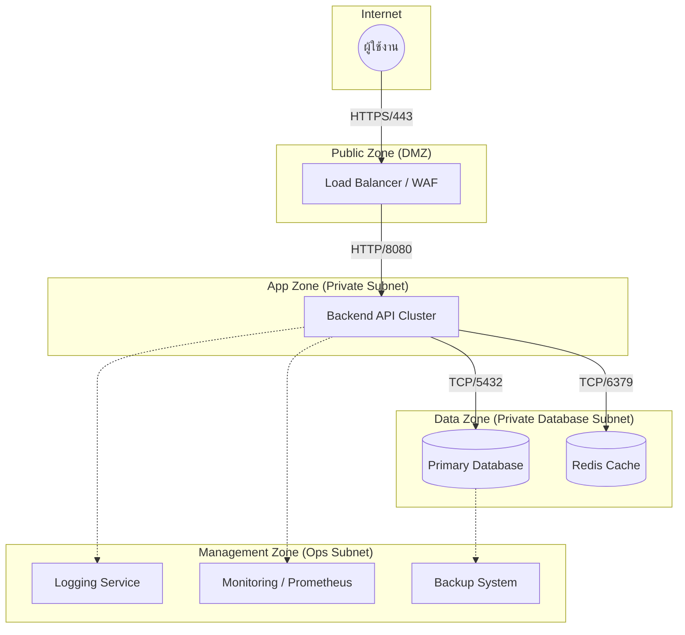

# สถาปัตยกรรมแบ่งแยกเครือข่าย (Network Segmentation Architecture)

เอกสารฉบับนี้อธิบายถึงสถาปัตยกรรมสําหรับแบ่งแยกเครือข่าย (Network Segmentation) ของแพลตฟอร์ม Elixopay ซึ่งออกแบบมาเพื่อให้สอดคล้องกับมาตรฐานความปลอดภัยและข้อกําหนดสำหรับการยื่นขอใบอนุญาตประกอบธุรกิจ

## ภาพรวม (Overview)

สถาปัตยกรรมนี้ถูกออกแบบมาเพื่อบังคับใช้การแยกหน้าที่ (Separation of Duties) และการควบคุมการเข้าถึงอย่างเคร่งครัดผ่านการแบ่งโซนเครือข่าย โดยแบ่งออกเป็นโซนหลักๆ ดังนี้:

1.  **โซนสาธารณะ (Public Zone / DMZ)**: สําหรับบริการที่ต้องเชื่อมต่อกับสาธารณะ เช่น Load Balancer และ Web Application Firewall (WAF)
2.  **โซนแอปพลิเคชัน (App Zone / Private)**: พื้นที่สําหรับการประมวลผลและการทํางานของ API ซึ่งไม่มีการเชื่อมต่อกับอินเทอร์เน็ตโดยตรง
3.  **โซนข้อมูล (Data Zone / Secure)**: พื้นที่จัดเก็บฐานข้อมูลและข้อมูลที่มีความละเอียดอ่อน ถูกแยกออกมาอย่างเด็ดขาด และเข้าถึงได้เฉพาะจากโซนแอปพลิเคชันเท่านั้น
4.  **โซนจัดการระบบ (Management Zone)**: สําหรับระบบ Logging, Monitoring และ Backup

## แผนภาพเครือข่าย (Network Diagram)

## มาตรการควบคุมความปลอดภัย (Security Controls)

### 1. การแยกโซนสาธารณะและส่วนตัว (Public / Private Zone Separation)
-   **โซนสาธารณะ (Public Zone)**: มีเพียง Load Balancer (Nginx/HAProxy) และ WAF เท่านั้นที่อยู่ในโซนนี้ และเป็นส่วนเดียวที่มี Public IP Address
-   **โซนส่วนตัว (Private Zone)**: ใช้สําหรับ Backend API ซึ่งอยู่ใน Subnet ที่ **ไม่มี** ช่องทางเชื่อมต่อจากอินเทอร์เน็ตโดยตรง (No Public Ingress) การจราจรทั้งหมดต้องผ่าน Load Balancer เท่านั้น

### 2. การแยกฐานข้อมูล (Database Isolation)
-   **ข้อกําหนด**: "Database ต้องอยู่ private subnet"
-   **การดําเนินการ**: ฐานข้อมูลถูกจัดวางไว้ใน **Data Zone** ซึ่งเป็น Subnet ที่ถูกแยกออกมาอย่างเข้มงวด
    -   **การควบคุมการเข้าถึง (Access Control)**: Security Groups / Network ACLs อนุญาตให้มีการเชื่อมต่อเข้ามาเฉพาะจาก **App Zone** ผ่านพอร์ตฐานข้อมูล (เช่น 5432) เท่านั้น
    -   **ไม่มีอินเทอร์เน็ต (No Internet Access)**: เซิร์ฟเวอร์ฐานข้อมูลไม่มี Public IP และไม่สามารถเข้าถึงได้จากอินเทอร์เน็ตโดยตรง เพื่อป้องกันการโจมตี

### 3. การแยก Logging และ Monitoring (Separation of Monitoring)
-   **การดําเนินการ**: ระบบ Logging และ Monitoring (เช่น ELK Stack, Prometheus/Grafana) ถูกจัดวางไว้ใน **Management Zone** แยกต่างหาก
-   **ประโยชน์**: เพื่อให้มั่นใจว่าข้อมูล Log ด้านความปลอดภัยจะถูกจัดเก็บแยกจากตัวแอปพลิเคชัน ป้องกันการถูกแก้ไขหรือลบหากแอปพลิเคชันถูกบุกรุก

### 4. ระบบสํารองข้อมูล (Backup Systems)
-   **การดําเนินการ**: การสํารองข้อมูลอัตโนมัติจะถูกสั่งการมาจาก **Management Zone**
    -   **การจัดเก็บ**: ข้อมูล Backups จะถูกเข้ารหัสและจัดเก็บในพื้นที่จัดเก็บข้อมูลแยกต่างหาก (Immutable Storage) เช่น S3 Glacier หรือเซิร์ฟเวอร์ที่อยู่คนละสถานที่
    -   **ความถี่**: สํารองข้อมูลส่วนที่เปลี่ยนแปลงทุกวัน (Daily Incremental) และสํารองข้อมูลทั้งหมดรายสัปดาห์ (Weekly Full Backup)

## การจำลองระบบสำหรับการทดสอบ (Deployment Simulation)

เพื่อจำลองสถาปัตยกรรมนี้ในเครื่องหรือสำหรับการทดสอบ เราใช้ `docker-compose` โดยแยก Network ดังนี้:

-   `public_net`: เชื่อมต่อ Frontend/Load Balancer เข้าด้วยกัน
-   `app_net`: เชื่อมต่อ Load Balancer กับ Backend
-   `data_net`: เชื่อมต่อ Backend กับ Database
-   `mgmt_net`: เชื่อมต่อ Services ต่างๆ เข้ากับระบบ Monitoring

การตั้งค่านี้ช่วยยืนยันว่า แม้ในสภาพแวดล้อมจำลอง (Containerized Environment) ตัวฐานข้อมูล (Database) จะ **ไม่สามารถ** ถูกเข้าถึงได้โดยตรงจาก Frontend หากไม่มีการผ่าน Backend ตามนโยบายความปลอดภัย
